# How to Integrate Power BI with QIoT Suite

## 1. Get your first Power BI account

- Sign up for a free PowerBI account at https://powerbi.microsoft.com/en-us/
  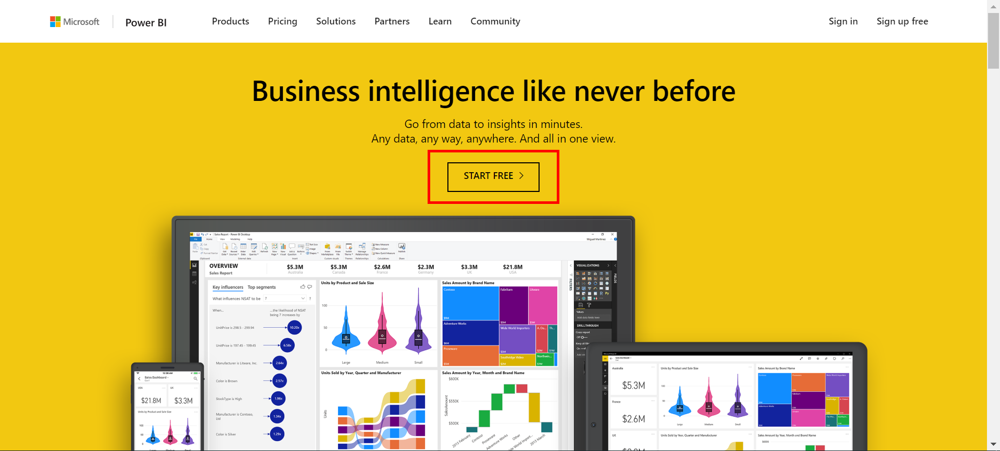
  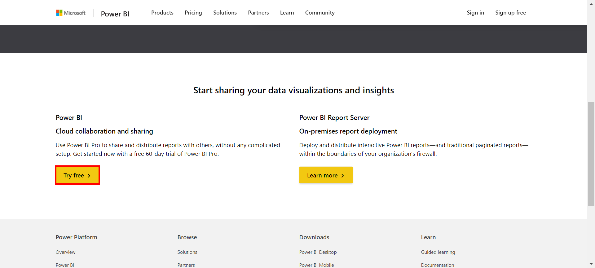
  
- After registering, you will see the following page:
  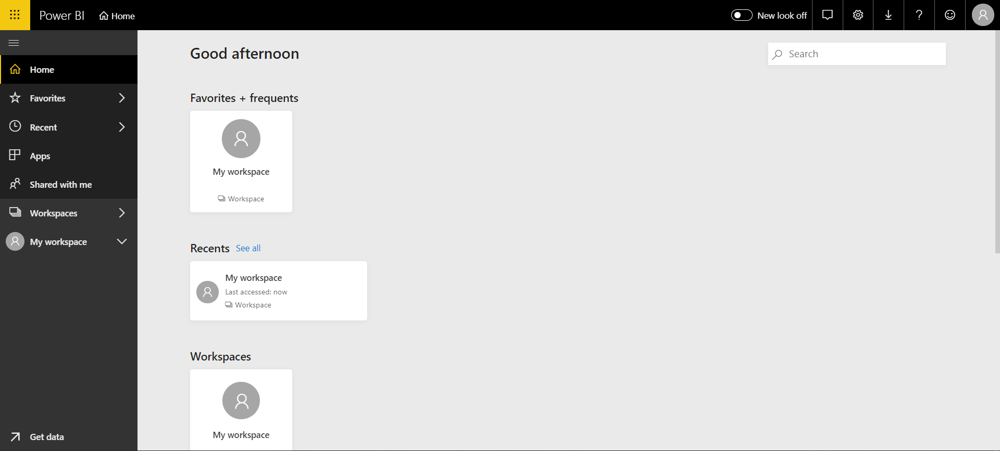

## 2. Setup your streaming dataset API

- Cleck **\[My workspace\]** then click on the left menu **\[Create\]->\[Streaming datasets\]** in the top-right corner.
  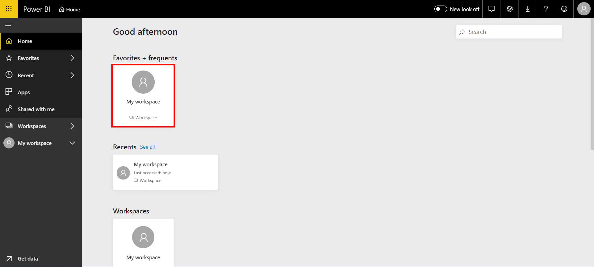
  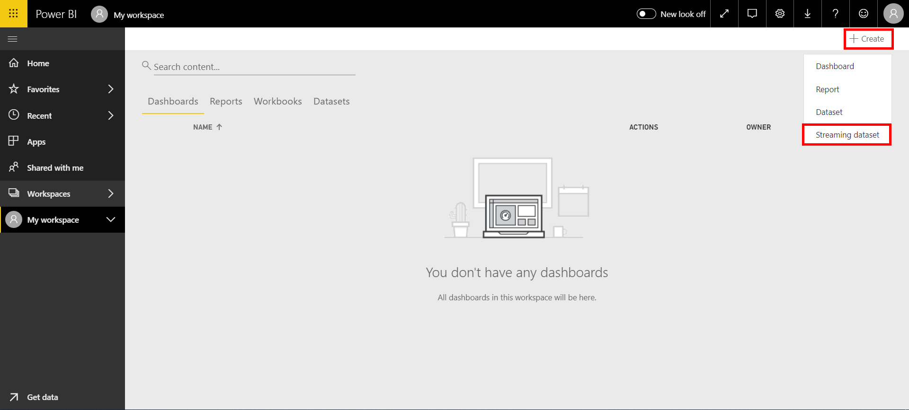

- Select **\[API\]** as your source of data, and click **\[Next\]**.
  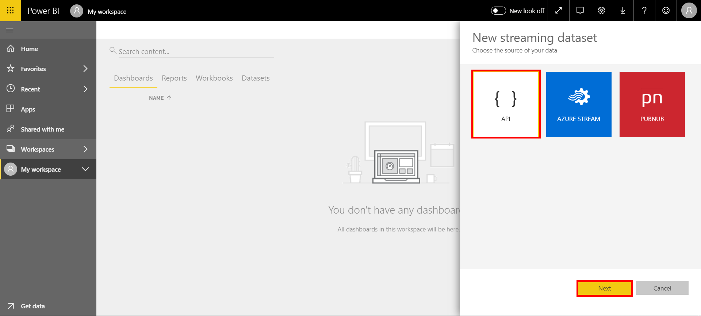
  
- Define your values from stream, and you will get a JSON result in the textbox. We will use this JSON code to push data to the IoT application. Click **\[Create\]** to finish.
  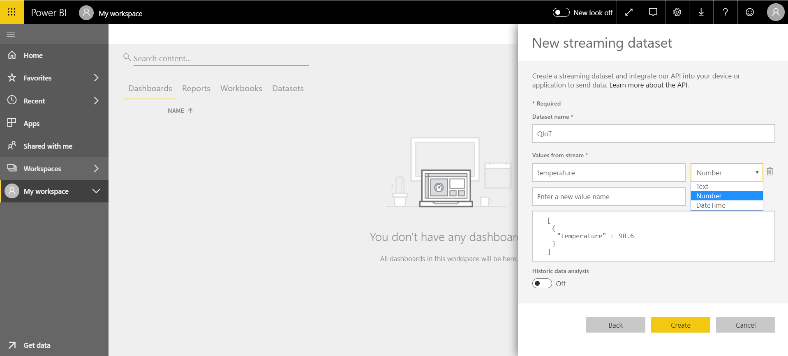
  
- Once you create your data stream, you get a Push URL which IoT applications can call using POST requests to push your live data to the streaming data dataset you created.
  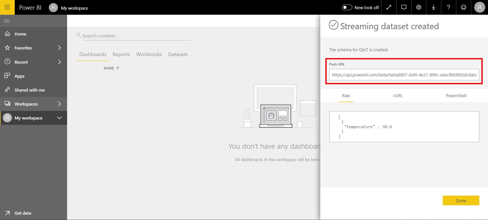

## 3. Configure Node-RED’s nodes in IoT application

- Create an IoT application in QIoT Suite. The following is your first Node-RED flow, and then you can start creating your own IoT flow. You can learn more about Node-RED at https://nodered.org/
  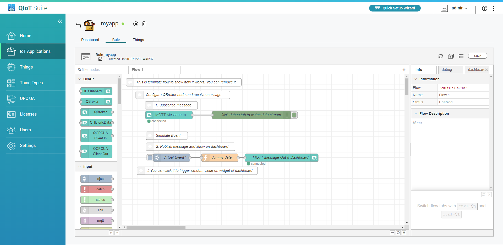
  
- Before you start pushing live data to Power BI. We need a **\[change\]** node to convert IoT data to a streaming data dataset. Follow image below to set. Here you can replace **temperature** to your value-key in dataset or use the **\[function\]** node for more flexible settings.
  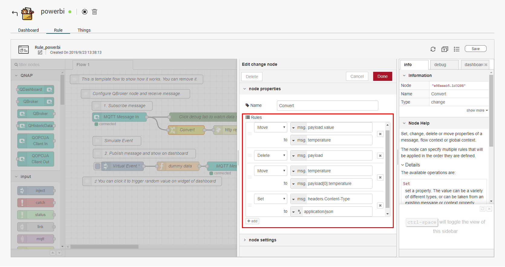
  
- We need an **\[http request\]** node to help us to push live data to Power BI. Just drag and drop the **\[http request\]** node and connect to the tail of the **\[change\]** node.
  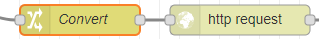
  
- Copy and paste the Push URL that you got from the Power BI console, and set http method to POST. Click **\[Save\]** to save changes.
  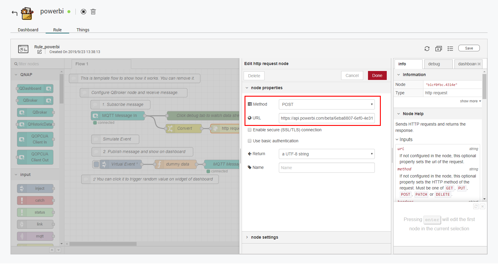
  
- Your Node-RED flow will look like below.
  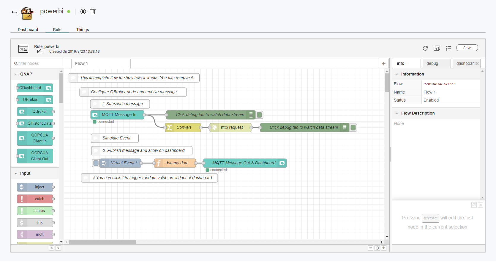
  
- Node-Red sample export to reference : 
    ```json
    [
    {
        "id": "2050223d.9dc9de",
        "type": "debug",
        "z": "c01d41a4.a2fbc",
        "name": "Click debug tab to watch data stream",
        "active": true,
        "console": "false",
        "complete": "false",
        "x": 494,
        "y": 157,
        "wires": []
    },
    {
        "id": "34caa285.75b72e",
        "type": "qiotbroker in",
        "z": "c01d41a4.a2fbc",
        "name": "MQTT Message In",
        "flow": "c01d41a4.a2fbc",
        "opt_customtopic": true,
        "customtopic": "USER_TOPIC_db514d80",
        "thing": "",
        "qtopic": "",
        "username": "admin",
        "rules": [],
        "outputs": 1,
        "key": "r:12907185af0147439eb2bda156cd814d",
        "x": 179,
        "y": 157,
        "wires": [
            [
                "2050223d.9dc9de",
                "a98aaab5.1d3208"
            ]
        ]
    },
    {
        "id": "a98aaab5.1d3208",
        "type": "change",
        "z": "c01d41a4.a2fbc",
        "name": "Convert",
        "rules": [
            {
                "t": "move",
                "p": "payload.value",
                "pt": "msg",
                "to": "temperature",
                "tot": "msg"
            },
            {
                "t": "delete",
                "p": "payload",
                "pt": "msg"
            },
            {
                "t": "move",
                "p": "temperature",
                "pt": "msg",
                "to": "payload[0].temperature",
                "tot": "msg"
            },
            {
                "t": "set",
                "p": "headers.Content-Type",
                "pt": "msg",
                "to": "application/json",
                "tot": "str"
            }
        ],
        "action": "",
        "property": "",
        "from": "",
        "to": "",
        "reg": false,
        "x": 400,
        "y": 200,
        "wires": [
            [
                "b1cf0fbc.4314e"
            ]
        ]
    },
    {
        "id": "6d513804.860e08",
        "type": "debug",
        "z": "c01d41a4.a2fbc",
        "name": "Click debug tab to watch data stream",
        "active": true,
        "tosidebar": true,
        "console": false,
        "tostatus": false,
        "complete": "payload",
        "x": 810,
        "y": 200,
        "wires": []
    },
    {
        "id": "b1cf0fbc.4314e",
        "type": "http request",
        "z": "c01d41a4.a2fbc",
        "name": "",
        "method": "POST",
        "ret": "txt",
        "url": "https://api.powerbi.com/beta/6eba8807-6ef0-4e31-890c-a6ecfbb98568/datasets/28c220f3-df96-41d4-a74e-a86db6743c49/rows?key=OzjegMmsmOm%2Bg6II%2Bnx1HTAio%2FhxCRZtKwt3TeA3uW4HyN2BT1SU2xJ%2F5RTq%2F2sLkm1sA5F02KxdilA3x41Phw%3D%3D",
        "tls": "",
        "x": 560,
        "y": 200,
        "wires": [
            [
                "6d513804.860e08"
            ]
        ]
    },
    {
        "id": "2e4aa64c.5fc46a",
        "type": "qiotbroker out",
        "z": "c01d41a4.a2fbc",
        "name": "MQTT Message Out & Dashboard",
        "opt_customtopic": true,
        "topic": "USER_TOPIC_db514d80",
        "qos": "",
        "retain": "",
        "thing": "",
        "qtopic": "",
        "username": "admin",
        "x": 609,
        "y": 320,
        "wires": []
    },
    {
        "id": "d9f122ca.132e9",
        "type": "function",
        "z": "c01d41a4.a2fbc",
        "name": "dummy data",
        "func": "var v = Math.floor(Math.random()*100+1);\nmsg.payload = {value:v};\nreturn msg;",
        "outputs": 1,
        "noerr": 0,
        "x": 373,
        "y": 320,
        "wires": [
            [
                "2e4aa64c.5fc46a"
            ]
        ]
    },
    {
        "id": "9c04dde3.36d24",
        "type": "inject",
        "z": "c01d41a4.a2fbc",
        "name": "Virtual Event",
        "topic": "",
        "payload": "",
        "payloadType": "date",
        "repeat": "",
        "crontab": "",
        "once": true,
        "x": 189,
        "y": 320,
        "wires": [
            [
                "d9f122ca.132e9"
            ]
        ]
    }
    ]
    ```

## 4. Add tiles to display real-time data

- click on the left menu **\[Create\] -> \[Dashboards\]** in the top-right corner to create your first dashboard, then click **\[Add tile\]** to configure a widget.
  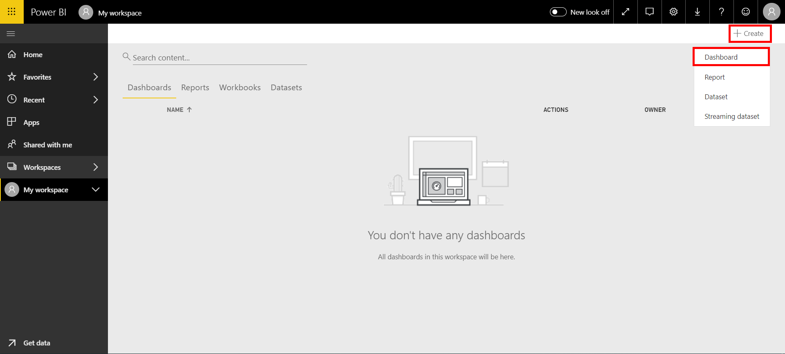
  
- Select **\[Custom Streaming Data\]** and click **\[Next\]**.
  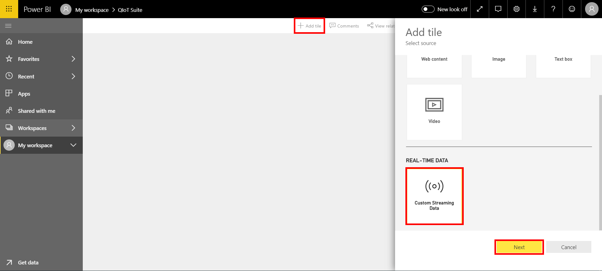
  
- Select datasets and click **\[Next\]**.
  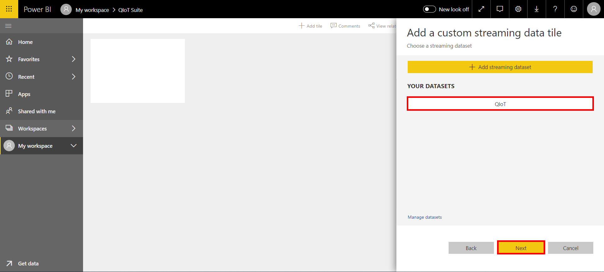
  
- Finally, set the title and so on according to your needs and click **\[Apply\]**. You will have a streaming dataset to work with, and you can get a real time gauge that looks as following.
  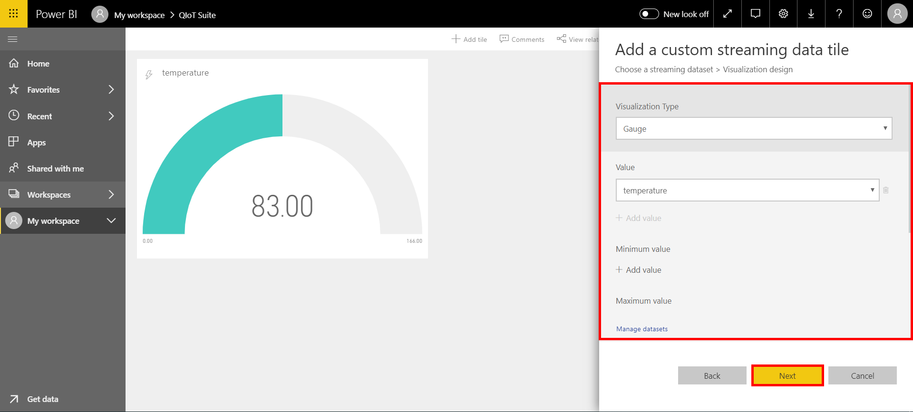
  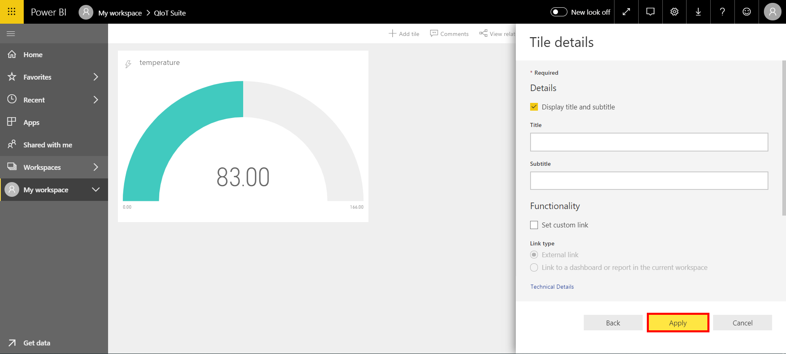
###### tags: `Tutorial`